# [AL.MAP.001] Карта домена

## Core flow

```mermaid
flowchart LR
    A["Исходный запрос и контекст системы"] --> M10["AL.M.010 Выбор маршрута"]
    M10 --> W10["WP.010 Основание и маршрут"]
    W10 -->|образовательная часть подтверждена| M1["AL.M.001 Диагностика запроса"]
    W10 -->|способность человека для будущей работы| HCD["HCD.1 / HCD.3"]
    HCD -->|квалифицированный объект + нужен adult-learning| M1
    W10 -->|хронический разрыв результативности| ATB["Pack-АТБ"]
    ATB -->|исполнители + действия + основания + контекст| M1
    M1 --> D14["D.014 Субъект результата × отношение к основаниям"]
    D14 --> W1["WP.001 Профиль запроса"]
    D14 --> W2["WP.002 Карта результатов"]
    W1 --> M4["M.004 Самонаправленность"]
    W1 --> M5["M.005 Тьюторство"]
    W2 --> M2["M.002 Опыт — осмысление — действие"]
    M2 --> W3["WP.003 Архитектура опыта"]
    M2 --> W4["WP.004 Практическое задание"]
    W4 --> M3["M.003 Проблемно-кейсовое обучение"]
    M3 --> W5["WP.005 Критериальная шкала и доказательства"]
    W4 --> M6["M.006 Перенос"]
    M6 --> W7["WP.007 План переноса"]
    W7 -. свидетельства переноса .-> HCD
    W5 --> M7["M.007 Оценивание эффектов"]
    W7 --> M7
    M7 --> W8["WP.008 Отчёт об эффектах"]
    W5 -. данные выполнения .-> HCD
    M8["M.008 Экосистемное ДПО"] -. согласует .-> W2
    M8 -. обеспечивает среду .-> W7
    W2 --> M9["M.009 Развивающий переход"]
    M2 -. конфликт и данные .-> TOC9["Pack-TOC: полная туча и ограничивающее предположение"]
    TOC9 -. проверенное основание .-> M9
    M9 --> W9["WP.009 Карта развивающего перехода"]
    W9 --> M6
    W9 --> M7
```

## Navigation

| Need | Start | Then |
|---|---|---|
| Понять границы домена | `01A-bounded-context.md` | `ontology.md` |
| Не путать ключевые понятия | `01B-distinctions.md` | `05-failure-modes/failure-modes.md` |
| Спроектировать обратную связь | AL.P.003 (`pilot`) | AL.D.006, AL.SOTA.009, AL.M.002, AL.WP.004, AL.WP.005 |
| Спроектировать воспроизведение по памяти | AL.P.004 (`pilot`) | AL.D.004, AL.D.006, AL.SOTA.010, AL.M.002, AL.M.003, AL.WP.003–005 |
| Управлять когнитивными требованиями и поддержкой | AL.P.005 (`pilot`) | AL.D.004, AL.D.011, AL.SOTA.011, AL.M.002–004, AL.WP.003, AL.WP.004, AL.WP.006 |
| Перевести от примера к самостоятельному действию | AL.P.005 (`pilot`) | AL.D.004, AL.D.011, AL.SOTA.012, AL.M.002, AL.M.004, AL.WP.003, AL.WP.004, AL.WP.006 |
| Спроектировать продуктивный запрос помощи | AL.P.002 (`pilot`) | AL.OA.007, AL.D.006, AL.SOTA.013–014, AL.M.002, AL.M.004, AL.M.005, AL.WP.003, AL.WP.006 |
| Обеспечить безопасный вопрос, предупреждение и эскалацию | AL.P.015 (`pilot`) | AL.SOTA.014, AL.OA.007, AL.R.003–005, AL.M.004–005, AL.WP.006, AL.FM.008 |
| Учиться на ошибке и справедливо распределять ответственность | AL.P.006 (`pilot`) | AL.D.012, AL.SOTA.015, AL.M.002, AL.M.004, AL.WP.005, AL.WP.006, AL.FM.005, AL.FM.008 |
| Доказать научение из ошибки или инцидента | AL.P.001 (`pilot`) | AL.D.007, AL.SOTA.016, AL.M.006, AL.M.007, AL.WP.005, AL.WP.007, AL.WP.008, AL.FM.006, AL.FM.007 |
| Проверить освоенную способность при использовании ИИ | AL.P.016 (`pilot`) | AL.SOTA.023, AL.D.011, AL.R.001–003, AL.R.005, AL.R.007, AL.WP.002, AL.WP.004–005, AL.WP.008 |
| Проверить основание запроса и выбрать системный маршрут | AL.P.018 (`pilot`) | AL.SOTA.025, AL.M.010 → AL.WP.010 → Pack-АТБ, другой системный домен, прямая проверка или остановка |
| Определить требуемую способность человека, диагностировать ограничение и решить, нужен ли специализированный метод обучения взрослых | HCD.1, HCD.3 | `human capability-demand account` + `qualified intervention target` либо `non-training return` → при необходимости adult-learning в AL.P.009 |
| Проверить образовательную часть и выбрать тип решения | AL.P.009 (`pilot`) | принять от исходного владельца исполнителей и действия; AL.D.003, AL.SOTA.017, AL.M.001 → проверить разрыв способности и создать AL.WP.001; при подтверждении → AL.WP.002; дефект требования вернуть владельцу |
| Выбрать вид научения по субъекту результата и отношению к основаниям | AL.D.014 | отдельный взрослый или коллектив × действие в пределах оснований или с их пересмотром → раздельные результаты, методы и доказательства в AL.WP.001–002; для развития → AL.M.009 и AL.WP.009 |
| Проверить условия применения деятельностного или развивающего метода | DPF §7.10 и раздел `:1.1` выбранного паттерна | отделить общую рамку AL.P.017 и обязательный перенос AL.P.007 от методов; выбрать свою, временную или чужую готовую среду; стажировку вести через AL.P.035 с картой различий и обратным переносом |
| Согласовать результат, практическое задание и доказательство освоения | AL.P.011 (`pilot`) | AL.SOTA.019, AL.WP.002–005, AL.M.002, AL.M.003, AL.M.007 |
| Спроектировать учебный кейс, проблему или симуляцию | AL.P.014 (`pilot`) | AL.SOTA.022, AL.M.003, AL.R.002–003, AL.R.005 → AL.WP.003–005 |
| Преобразовать профессиональный опыт в проверяемое новое действие | AL.P.012 (`pilot`) | AL.SOTA.020, AL.OA.002, AL.OA.006, AL.M.002 → AL.WP.003 |
| Выявить конфликт и ограничивающее убеждение для развивающего перехода | Pack-TOC `TOC.M.003`, `TOC.M.004`, `TOC.M.009`, `TOC.D.006` | проверить обе стороны конфликта и передать результат в AL.P.017 → AL.WP.009 |
| Выбрать и пересматривать индивидуальную траекторию | AL.P.010 (`pilot`) | AL.D.009, AL.M.004, AL.M.005, AL.SOTA.018 → AL.WP.006 |
| Сравнить полные программы, профиль способностей и общий индивидуальный маршрут | HCD.2, HCD.4, HCD.14, HCD.15 | HCD принимает специализированные adult-learning механизмы, но сохраняет решение о программе и её пересмотре |
| Обеспечить рабочее применение | AL.P.007 (`pilot`) | AL.M.006, AL.SOTA.008, AL.WP.007, AL.WP.008 |
| Освоить практику в уже работающей альтернативной среде | AL.P.035 (`pilot`, после редакции `.31`) | предметный заказ Pack-ATB или другого домена → сопоставимая роль и реальные циклы → при необходимости контрастная проверка прогноза → карта различий → AL.P.007; системные условия вернуть Pack-ATB/OCE |
| Оценить эффект | AL.P.008 (`pilot`) | AL.M.007, AL.WP.005, AL.WP.008 |
| Построить партнёрскую ДПО | AL.P.013 (`pilot`) | AL.SOTA.021, AL.M.008, AL.R.001–002, AL.R.004–007 → AL.WP.002, AL.WP.007, AL.WP.008 |
| Спроектировать развивающий переход | AL.P.017 (`pilot`) | AL.SOTA.024, AL.SOTA.030, AL.D.013, AL.M.009, AL.R.001–003, AL.R.005–007 → AL.WP.009 → AL.WP.003–005, AL.WP.007–008 |
| Проверить ключевое предположение и закрепить изменение по Кигану и Лейхи | AL.SOTA.030 → AL.P.017, AL.M.009, AL.WP.009 | для обоснованной альтернативы → AL.P.020; для общей карты и личных карт вокруг общей цели → AL.P.022; проверки в работе, повтор, восстановление и передача поддержки |
| Проверить новое основание в реальной совместной работе до масштабирования | AL.P.019 (`pilot`) | AL.SOTA.024, Pack-TOC, AL.P.017, AL.M.009 → AL.WP.009 → AL.P.003, AL.P.007–008 |
| Освоить действие на новом основании в обычной рабочей среде | AL.P.020 (`pilot`) | AL.SOTA.024, STH.DEV.069, AL.P.017, AL.M.009 → AL.WP.009 → AL.P.003, AL.P.005, AL.P.007–008; при блокировке среды → AL.P.019 |
| Построить ещё неизвестное решение совместно с группой практиков | AL.P.021 (`pilot`) | AL.SOTA.024, STH.DEV.042, STH.DEV.058–060, AL.M.002 → AL.WP.003, AL.WP.007–009 → AL.P.003, AL.P.007–008, AL.P.012–013, AL.P.015, AL.P.017, AL.P.019–020 |
| Встроить научение в уже принадлежащее группе организационное изменение | AL.P.022 (`pilot`) | AL.SOTA.024, STH.DEV.045, STH.DEV.062, AL.M.002, AL.M.009 → AL.WP.003, AL.WP.007–009 → AL.P.003, AL.P.007–008, AL.P.012, AL.P.015, AL.P.017–021 |
| Проверить, не создаёт ли повторяющееся «личное» затруднение сама система | AL.P.023 (`pilot`) | AL.SOTA.024, STH.DEV.045, STH.DEV.061, AL.P.018, AL.M.010 → AL.WP.010 → AL.P.009, AL.P.012, AL.P.015, AL.P.017, AL.P.021–022, Pack-АТБ, Pack-TOC |
| Связать основание конкретного человека с поддерживающими условиями организации и выбрать предмет изменения | AL.P.024 (`pilot`) | AL.SOTA.024, STH.DEV.045, STH.DEV.063–064, AL.P.018, AL.M.009 → AL.WP.009 → AL.P.009, AL.P.012, AL.P.017, AL.P.019–020, AL.P.023, Pack-АТБ, Pack-TOC |
| Выбрать подход к образованию по требуемому результату | AL.P.028 (`pilot`, редакция `.31`) | AL.P.018 → AL.P.009 → различить известную способность, целостную деятельность, открытую проблему, смену контекста, ценностный конфликт или новые отношения → AL.P.029–034 |
| Освоить известное действие по заданному критерию | AL.P.029 (`pilot`, редакция `.31`) | карта способности → образец и объяснение → поддержанная практика → самостоятельная проба → AL.P.003, AL.P.005, AL.P.007–008, AL.P.011 |
| Освоить целостную деятельность | AL.P.030 (`pilot`, редакция `.31`) | карта деятельности → целостные циклы с растущей самостоятельностью → реальные последствия → AL.P.007–008, AL.P.011–012, AL.P.020 |
| Построить способ разрешения открытой проблемы | AL.P.031 (`pilot`, редакция `.31`) | паспорт проблемы → три волны проблематизации, разработки и проверки → при производстве нового знания RMP.1–4 → AL.P.008, AL.P.012, AL.P.021 |
| Обеспечить перенос между существенно разными контекстами | AL.P.032 (`pilot`, редакция `.31`) | карта контекстного перехода → вариативные ситуации → выделение инварианта и изменяемых условий → AL.P.007–008, AL.P.011, AL.P.014 |
| Исследовать добровольно признанный ценностный конфликт | AL.P.033 (`pilot/bounded`, редакция `.31`) | AL.P.017 → различение ценности, предположения, убеждения, интереса, нормы и отношения → безопасные рабочие пробы → AL.P.020, Pack-TOC |
| Освоить новые отношения, роли и действия | AL.P.034 (`pilot/bounded`, редакция `.31`) | назвать единицу изменения и версию результата → безопасный значимый опыт → действие, последствия, осмысление и повтор → AL.P.017, AL.P.019–024 |
| Организовать научение группы внутри обоснованной и полномочной трансформации | AL.P.022 (`pilot`) | Pack-АТБ или другой предметный домен → AL.P.018 → AL.SOTA.026, AL.M.009 → AL.WP.009 → AL.P.020, AL.P.007–008; AL.P.025 отозван как междоменный дубль |
| Провести полную Лабораторию изменений по архитектуре Энгестрёма | AL.P.026 (`candidate/bounded`) | AL.SOTA.026 → предварительное исследование → зеркальные данные → двойная стимуляция → семь учебных действий → реальные пробы → закрепление; предметное решение из Pack-АТБ, Pack-TOC или другого домена |
| Провести ОДИ для открытой коллективной проблемы без предзаданного способа решения | AL.P.027 (`candidate/bounded`) | AL.P.018 → AL.SOTA.027 → предварительная диагностика → собственный организационный проект → программа-гипотеза → позиции и функции команды → проблематизация, схематизация, рефлексия и самоопределение → раздельные результаты → послеигровой переход; при хроническом разрыве сначала Pack-АТБ, AL.P.026 остаётся отдельной альтернативой |
| Проверить основание, статус и границы утверждения | `06-sota/source-register.md` | профиль оснований, допустимое использование и критерий пересмотра |
| Вернуть индивидуальные доказательства выполнения, переноса, сохранения и зависимости от ИИ | AL.P.007, AL.P.011, AL.P.016 → HCD.11–13 | HCD квалифицирует итоговый capability-claim; Pack сохраняет только образовательный механизм и наблюдения |
| Квалифицировать производство нового знания внутри учебной работы | AL.P.008, AL.P.018–021 → RMP.1–4 | RMP возвращает остановку либо исследовательский вопрос, дизайн, исполнимый протокол и проверяемый след; Pack сохраняет учебный механизм, а HCD и OCE — свои результаты |

| Спроектировать рефлексию в действии и после действия с предметным наставником | AL.SOTA.029 → AL.M.002–003, AL.M.005 | AL.P.003, AL.P.011–012 → AL.WP.003–004; функции пробы, ответ ситуации, промежуточные продукты и следующая попытка |
| Связать переосмысление ситуации с проверкой изменения основания | AL.SOTA.029 → AL.D.013, AL.M.009, AL.P.017 | AL.WP.009; новое описание не равно закреплённому переходу; предметный заказ Pack-АТБ и конфликтующие предположения Pack-TOC |

## Quality gates

1. **Routing gate:** WP.010 фиксирует происхождение запроса, границу рассматриваемой системы, первое лицо, мандат, тип ситуации и маршрут; хронический разрыв результативности не подменяется локальной диагностикой обучения.
2. **Request gate:** WP.001 содержит действие, контекст и авторство цели, принятые из зафиксированного маршрута.
3. **Alignment gate:** результат, практика и доказательство связаны моделями способности, доказательства и задания; уровень действия, выборка задач, режим поддержки, индивидуальность вывода и последствия решения названы.
4. **Adult-learning gate:** опыт и готовность к самостоятельности реально диагностированы.
5. **Safety gate:** проблематизация, обратная связь и сбор данных имеют границы и право отказа; комментарий о личности не подменяет данные о задаче, процессе и саморегуляции.
6. **Transfer gate:** среда применения и ответственность сторон подтверждены, а вывод о переносе опирается не только на самоотчёт и учитывает тип рабочего действия.
7. **Evidence gate:** сила вывода не превышает качество данных.
8. **AI-support gate:** названы объект вывода, целевой режим и существенные действия человека; результат сеанса, способность человека и способность системы «человек + ИИ» не смешаны; контроль проверен на полезной и существенно ошибочной рекомендации; происхождение опирается на совокупность свидетельств; изменение, сбой и граница конфигурации соответствуют широте вывода; поддержанное выполнение, освоение и эффект программы разделены.
9. **Retention gate:** если требуется долговременное сохранение знания, архитектура включает воспроизведение без доступа к образцу, коррекцию ошибки и новую попытку; перенос в рабочую практику проверяется отдельно.
10. **Cognitive-demands gate:** существенная сложность, лишние требования, реалистичность и временная поддержка различены; самостоятельная способность не выводится только из выполнения с подсказкой.
11. **Support-transfer gate:** помощь соответствует конкретному выполнению, допускает снятие и возврат, а передача ответственности подтверждается самостоятельной контрольной пробой.
12. **Help-seeking gate:** для затруднения заданы доступные источники, минимально достаточные уровни помощи и условия немедленной эскалации; после помощи участник перерабатывает ответ и выполняет новую пробу, а качество не выводится из числа вопросов.
13. **Psychological-safety gate:** реальная реакция на вопрос, ошибку и предупреждение не унижает добросовестного участника; для угрозы заданы адресат с полномочиями, срок подтверждения, следующий уровень и возврат результата, а предметные стандарты и ответственность сохранены.
    Регистрация не считается закрытием; режим канала и предел идентифицируемости объявлены; при конфликте доступен независимый адресат; число сообщений не заменяет данные реакции и результата; цифровой или ИИ-вход подтверждает передачу человеку с полномочиями.
14. **Error-learning gate:** действие, исход, нарушение и вывод об ответственности различены; защищённая учебная ошибка ведёт к коррекции и новой пробе, а рабочее событие — к сохранению данных, проверяемому изменению и объяснимому решению по объявленной процедуре.
15. **Incident-learning evidence gate:** сообщение, вывод, изменение, внедрение, соблюдение, результат, устойчивость и перенос измеряются раздельно; число сообщений и закрытых мероприятий не подменяют операционный эффект, а показатели учитывают экспозицию и ограничения интерпретации.
16. **Request-diagnosis gate:** исполнители и требуемое действие получены от названного компетентного владельца, а не выбраны Pack; тема и разрыв выполнения не выданы за образовательную потребность; отдельно названы субъект результата и необходимость пересмотра оснований; несколько клеток `AL.D.014` имеют раздельные результаты и доказательства; способность, возможность и мотивация проверены по достаточным данным; дефект требования возвращается владельцу.
17. **Adaptive-trajectory gate:** назван изменяемый компонент, данные, правило, ожидаемый результат и контрольная точка; активность сопровождения и ИИ-рекомендация не выданы за результат.
18. **Experience-transformation gate:** след события отделён от позднего объяснения; стаж не выдан за экспертизу; есть проверяемая альтернатива и изменённая проба; функции раскрытия, читатели, последствия и предел конфиденциальности известны.
19. **Partner-configuration gate:** каждый партнёр закрывает необходимый переход; результаты сторон, локальные обязательства, рабочий объект, критерий приёмки, полномочия, данные и сценарий отказа названы; процесс сети не выдан за результат взрослого, а ИИ не назначен владельцем решения.
20. **Problem-case gate:** вид конструкции назван по действию и реакции среды; существенные признаки меняют решение; информационный режим и поддержка функциональны; совместный продукт имеет индивидуальный след; разбор ведёт к новой пробе; выборка, симуляция и ИИ имеют явные границы вывода.
21. **Development gate:** освоение, совершенствование и развитие различены, выбрана минимально достаточная глубина; содержание, способ решения и предпосылки не смешаны; противоречие не создаётся искусственным потрясением; проверяемый диалог допускает данные, возражения и альтернативы; новое объяснение доведено до плана, способности, безопасной пробы и повтора; названы авторство, мандат, поддержка и препятствия среды, «Я — Мы — Это», жизнеспособность и раздельные непосредственный, отсроченный и организационный результаты. Если основание связано с устойчивым конфликтом, обе стороны проверены средствами Pack-TOC без предположения о заранее неправом исполнителе; гипотеза открыта для исправления.
22. **Field-school gate:** проверенное решение испытывается на ограниченном реальном объекте во временно разрешённой системе ролей и правил; выполнены повторные циклы с данными; самостоятельность, перенос и эффект всей системы проверяются отдельно от группового согласия и локального результата.
23. **Action-research gate:** принятие новой перспективы не выдано за способность; опорная модель конкретна и пересматриваема; участник сохраняет существенные решения; реальные циклы меняются по данным; поддержка снимается; препятствия основания, модели, способности и среды разделены.
24. **Collaborative-inquiry gate:** вопрос действительно принадлежит группе и не имеет назначенного ответа; полномочия и должностная власть видимы; конкурирующие объяснения проверяются повторными рабочими циклами; отрицательные случаи и особые мнения сохраняются; предварительное знание ограничено проверенными условиями; индивидуальное научение, групповая практика и системный эффект разведены.
25. **Reflective-participation gate:** устойчивая группа действительно владеет ведущимся изменением; участие не скрывает чужого решения или риска санкций; цель и локальный интерес проверены относительно целой системы; завершённый эпизод ведёт к отличающемуся следующему действию; преподаватель не присваивает управление; индивидуальное научение, совместная способность, ход изменения и системный эффект разведены.
26. **Collective-clarification gate:** несколько сопоставимых эпизодов людей в сходном положении отделены от оценок; первый круг защищён от прямой санкционной зависимости; повторяющиеся условия сопоставлены с исключениями; личные и системные объяснения сохранены; отношения власти не назначены причиной заранее; гипотеза ограничена и передана владельцу или в предметный домен.
27. **Personal-social-integration gate:** конкретный эпизод связан с личным основанием, его прежней полезностью и необходимой функцией; организационное условие проверено отдельно; человек и система не назначены причиной заранее; выбран предмет изменения; новое действие и изменение условия согласованы по владельцам, мандату, риску и раздельным результатам.
28. **Learning-within-transformation gate:** происхождение, решение и организационная часть преобразования получены из Pack-АТБ, OCE или другого компетентного домена; заданное отделено от решений группы; наблюдаемые данные отделены от диагноза консультанта; есть мандат, безопасное возражение, рабочая проба и повтор; индивидуальное освоение, совместная способность, практика, устойчивость и системный эффект имеют отдельные свидетельства.
29. **Change-Laboratory gate:** полная лаборатория включает предварительное исследование, представительную группу, защищённые зеркальные данные, системный и исторический анализ, создаваемое участниками средство двойной стимуляции, порождающую модель, семь различимых учебных действий, полномочные реальные пробы, повторы, план закрепления и отсроченное наблюдение; короткий семинар или готовая модель обозначены только как фрагмент.
30. **OAG gate:** ОДИ применяется к проблеме без заранее известного способа решения после проверки более простых форматов; заказ, тема, ситуация и проблема различены; есть диагностика, собственный организационный проект, представительные позиции, способная команда, открытые цели и власть, изменяемая программа со следом решений, безопасная проблематизация, оспариваемые схемы, самоопределение, пять раздельных результатов и послеигровой переход при обещании внешнего эффекта.
31. **HCD handoff gate:** для индивидуального развития названы человек,
    представительная будущая работа, требуемый вклад, квалифицированный объект
    развития, текущая конфигурация выполнения и условия участия; Pack выбирает
    и описывает специализированный механизм обучения взрослых, а общий выбор
    программы и выводы о способности, переносе, сохранении и зависимости от
    поддержки возвращаются в HCD.
32. **RMP handoff gate:** учебный вопрос, рабочая проба, рефлексия и локальная
    гипотеза не выданы за исследование; при обещании нового знания отдельно
    получены применимые результаты RMP.1–4, а намерения протокола отделены от
    фактического следа. Анализ, достоверность, синтез знания, освоение человека
    и изменение организации не выводятся из одного исследовательского журнала.
33. **Method-applicability gate:** деятельностный или развивающий метод выбран только после проверки его обязательных условий, владельцев и свидетельств; отсутствие критического условия ведёт к созданию условия, смене метода или ограничению заявления, а не к сохранению привлекательного названия.
34. **Educational-approach gate:** подход выбран по требуемой продукции и существенному механизму, а не по теме или названию мероприятия; расширение опыта отделено от изменения смысла; составная программа согласует содержание, действия, методы, роль преподавателя, среды, целостную организационную форму, свидетельства и условия перехода; вмешательство в ценности и отношения не применяется без необходимости, согласия и безопасной проверки; корпоративный контур замыкается на полномочного владельца системных решений.

## Дополнение маршрута ОДИ после интеграции 035–043

При применении `AL.P.027` используются принятые дополнения `AL.SOTA.027`, `STH.ODI.CLAIM.035–043`. Разные профессиональные представления и их деятельностные основания ведут к работе со схемами и смене опорного изображения объекта; недостаточность средств может потребовать пересмотра постановки. Параллельно уточняются позиции участников и учитываются реакции партнёров. Разбор сохраняет предметное решение отдельно от изменения способа работы. Основной механизм находится в уточнении фазы C `AL.P.027`; общие связи — в `AL.M.009` и `AL.M.002`; фактический след — в `AL.WP.009`, проектирование — в `AL.WP.003`, признаки проверки — в `AL.WP.005`, результаты — в `AL.WP.008`. Это синтез Pack, `current` в принятых границах; паттерн остаётся `candidate/bounded`. Возвраты не превращаются в универсальный календарный алгоритм, групповое согласие и новая схема не заменяют действия и проверки закрепления. Новые сущности не введены.

## Update log

**Редакция `.31`, 2026-09-25:** `AL.P.028–034` включены вместе с `AL.P.001–024` в выбранный набор из 31 паттерна. Семь новых паттернов прошли две серии по десять внутренних пограничных проб и оценку `E.21` на уровне 4 в предыдущем окне. Официальный FPF `3dae70b` сохранил `E.21`, но изменил связанные правила `E.4` и `E.8`; поэтому пакет имеет статус `refreshNeeded` до impact refresh всех 31 паттернов и представительского совместного применения набора.

**Исправление трассировки `STH.DEV.CLAIM.045–060`, 2026-09-25:** устранена преждевременная запись о полной интеграции. Все шестнадцать утверждений получили отдельные связи с решениями паттернов; `051`, `053`, `055`, `057` и `058` усилены содержательно. Десять целевых пограничных проб пройдены; точная редакция `.24` не расширена и пакетная оценка не повышена.

**Уточнение и повтор AL.SOTA.030, 2026-09-13:** AL.P.017 различает вход в исследовательскую пробу и освоение обоснованной альтернативы; развилка отражена в AL.M.009 и AL.WP.009. Все десять прежних синтетических ситуаций повторно разрешены (§19 РП), включая отсутствие готовой альтернативы при сохранённых согласии, полномочиях и риске. Требования AL.P.020 и оценки паттернов не изменены.

**Пограничные пробы AL.SOTA.030, 2026-09-13:** §18 РП содержит десять внутренних синтетических проверок: девять разрешены, одна выявила неоднозначность условий ранней исследовательской пробы AL.P.017. Правка ожидает решения пилота; оценки и статусы паттернов не повышены.

**Интеграция AL.SOTA.030, 2026-09-13:** все 27 принятых утверждений включены в `AL.P.017` (рамка перехода), `AL.P.020` (рабочие проверки и закрепление после обоснования альтернативы), `AL.P.022` (коллективная процедура и передача поддержки), `AL.M.009` и поля `AL.WP.009`. Истинность предположения исследуется отдельно от освоения обоснованного действия; личные карты не приравнены к общей карте. Прослеживаемость — §17 РП; роли, продукты и оценки паттернов не изменены, чтение всего корпуса остаётся открытым.

**Решение AL.SOTA.030, 2026-09-13:** `STH.KGL.CLAIM.027` принято с привязкой к случаю медицинского колледжа; все 27 сформулированных утверждений приняты. Решения находятся в §16 РП; интеграция и статусы паттернов не изменены, насыщение всего корпуса не объявлено.

**Решение AL.SOTA.030, 2026-09-13:** `STH.KGL.CLAIM.026` принято с привязкой к описанной программе; запись решения находится в §16 РП. Следующее — `027`; принято 26, ожидает решения 1, интеграция и статусы паттернов не изменены.

**Решение AL.SOTA.030, 2026-09-13:** `STH.KGL.CLAIM.025` принято для метода Кигана и Лейхи; запись решения находится в §16 РП. Следующее — `026`; принято 25, ожидают решения 2, интеграция и статусы паттернов не изменены.

**Решение AL.SOTA.030, 2026-09-13:** `STH.KGL.CLAIM.024` принято для коллективного метода Кигана и Лейхи; запись решения находится в §16 РП. Следующее — `025`; принято 24, ожидают решения 3, интеграция и статусы паттернов не изменены.

**Решение AL.SOTA.030, 2026-09-13:** `STH.KGL.CLAIM.023` принято для коллективного метода Кигана и Лейхи; запись решения находится в §16 РП. Следующее — `024`; принято 23, ожидают решения 4, интеграция и статусы паттернов не изменены.

**Решение AL.SOTA.030, 2026-09-13:** `STH.KGL.CLAIM.022` принято для коллективного метода Кигана и Лейхи; запись решения находится в §16 РП. Следующее — `023`; принято 22, ожидают решения 5, интеграция и статусы паттернов не изменены.

**Решение AL.SOTA.030, 2026-09-13:** `STH.KGL.CLAIM.021` принято для коллективного метода Кигана и Лейхи; запись решения находится в §16 РП. Следующее — `022`; принято 21, ожидают решения 6, интеграция и статусы паттернов не изменены.

**Решение AL.SOTA.030, 2026-09-13:** `STH.KGL.CLAIM.020` принято для метода Кигана и Лейхи; запись решения находится в §16 РП. Следующее — `021`; принято 20, ожидают решения 7, интеграция и статусы паттернов не изменены.

**Решение AL.SOTA.030, 2026-09-13:** `STH.KGL.CLAIM.019` принято с привязкой к случаю Кэти; запись решения находится в §16 РП. Следующее — `020`; принято 19, ожидают решения 8, интеграция и статусы паттернов не изменены.

**Решение AL.SOTA.030, 2026-09-13:** `STH.KGL.CLAIM.018` принято для метода Кигана и Лейхи; запись решения находится в §16 РП. Следующее — `019`; принято 18, ожидают решения 9, интеграция и статусы паттернов не изменены.

**Решение AL.SOTA.030, 2026-09-13:** `STH.KGL.CLAIM.017` принято для метода Кигана и Лейхи; запись решения находится в §16 РП. Следующее — `018`; принято 17, ожидают решения 10, интеграция и статусы паттернов не изменены.

**Решение AL.SOTA.030, 2026-09-13:** `STH.KGL.CLAIM.016` принято для метода Кигана и Лейхи; запись решения находится в §16 РП. Следующее — `017`; принято 16, ожидают решения 11, интеграция и статусы паттернов не изменены.

**Решение AL.SOTA.030, 2026-09-13:** `STH.KGL.CLAIM.015` принято для метода Кигана и Лейхи; запись решения находится в §16 РП. Следующее — `016`; принято 15, ожидают решения 12, интеграция и статусы паттернов не изменены.

**Решение AL.SOTA.030, 2026-09-13:** `STH.KGL.CLAIM.014` принято для метода Кигана и Лейхи; запись решения находится в §16 РП. Следующее — `015`; принято 14, ожидают решения 13, интеграция и статусы паттернов не изменены.

**Решение AL.SOTA.030, 2026-09-13:** `STH.KGL.CLAIM.013` принято для метода Кигана и Лейхи; запись решения находится в §16 РП. Следующее — `014`; принято 13, ожидают решения 14, интеграция и статусы паттернов не изменены.

**Решение AL.SOTA.030, 2026-09-13:** `STH.KGL.CLAIM.012` принято для метода Кигана и Лейхи; запись решения находится в §16 РП. Следующее — `013`; принято 12, ожидают решения 15, интеграция и статусы паттернов не изменены.

**Решение AL.SOTA.030, 2026-09-13:** `STH.KGL.CLAIM.011` принято для метода Кигана и Лейхи; запись решения находится в §16 РП. Следующее — `012`; принято 11, ожидают решения 16, интеграция и статусы паттернов не изменены.

**Решение AL.SOTA.030, 2026-09-13:** `STH.KGL.CLAIM.010` принято для метода Кигана и Лейхи; запись решения находится в §16 РП. Следующее — `011`; принято 10, ожидают решения 17, интеграция и статусы паттернов не изменены.

**Решение AL.SOTA.030, 2026-09-13:** `STH.KGL.CLAIM.009` принято для метода Кигана и Лейхи; запись решения находится в §16 РП. Следующее — `010`; принято 9, ожидают решения 18, интеграция и статусы паттернов не изменены.

**Решение AL.SOTA.030, 2026-09-13:** `STH.KGL.CLAIM.008` принято для метода Кигана и Лейхи; запись решения находится в §16 РП. Следующее — `009`; принято 8, ожидают решения 19, интеграция и статусы паттернов не изменены.

**Решение AL.SOTA.030, 2026-09-13:** `STH.KGL.CLAIM.007` принято для метода Кигана и Лейхи; запись решения находится в §16 РП. Следующее — `008`; принято 7, ожидают решения 20, интеграция и статусы паттернов не изменены.

**Решение AL.SOTA.030, 2026-09-13:** `STH.KGL.CLAIM.006` принято для метода Кигана и Лейхи; запись решения находится в §16 РП. Следующее — `007`; принято 6, ожидает решения 21, интеграция и статусы паттернов не изменены.

**Решение AL.SOTA.030, 2026-09-13:** `STH.KGL.CLAIM.005` принято для метода Кигана и Лейхи; запись решения находится в §16 РП. Следующее — `006`; принято 5, ожидают решения 22, интеграция и статусы паттернов не изменены.

**Решение AL.SOTA.030, 2026-09-13:** `STH.KGL.CLAIM.004` принято для метода Кигана и Лейхи; запись решения находится в §16 РП. Следующее — `005`; принято 4, ожидают решения 23, интеграция и статусы паттернов не изменены.

**Решение AL.SOTA.030, 2026-09-13:** `STH.KGL.CLAIM.003` принято для метода Кигана и Лейхи; запись решения находится в §16 РП. Следующее — `004`; принято 3, ожидают решения 24, интеграция и статусы паттернов не изменены.

**Решение AL.SOTA.030, 2026-09-13:** `STH.KGL.CLAIM.002` принято для метода Кигана и Лейхи; запись решения находится в §16 РП. Следующее — `003`; принято 2, ожидают решения 25, интеграция и статусы паттернов не изменены.

**Решение AL.SOTA.030, 2026-09-13:** `STH.KGL.CLAIM.001` принято как `current-practice` без обязательного срока; запись решения находится в §16 РП. Следующее для рассмотрения — `002`; 26 ожидают решения, интеграция и статусы паттернов не изменены.

**Рассмотрение AL.SOTA.030, 2026-09-13:** кандидаты `STH.KGL.CLAIM.001–027` доступны в §16 РП Кигана и Лейхи. Все ожидают решения пилота; индивидуальные проверки, коллективная процедура и организационное закрепление разделены. Счётчик 22 и статусы паттернов не изменены; интеграция не начата.

**Индивидуальные проверки AL.SOTA.030, 2026-09-13:** §15 РП фиксирует полное чтение текста глав 6 и 10; подробно описаны проектирование, разбор, повторение и закрепление действий. Позиции основателей и Zeitler о поддержке разделены. Счётчик 22, кандидаты и интеграция пока не начаты; статусы паттернов не изменены.

**Случаи главы 4 AL.SOTA.030, 2026-09-13:** §14 РП фиксирует полное чтение главы и различает диагностику, план проверок, рабочие результаты и закрепление пилотов. Найден практический материал об изменении условий деятельности вместе с предположениями; оригинал статьи 19 не объявлен прочитанным. 22 записи, без интеграции и изменений статусов паттернов.

**Полная книга AL.SOTA.030, 2026-09-13:** §13 РП фиксирует прямое чтение глав 7 и 11 русского перевода, начало главы 4. Различены общая карта группы и личные карты вокруг общей цели; описаны рабочие проверки и передача поддержки команде. Барьер доступа к книге снят, но оставшееся чтение не объявлено завершённым. Счётчик 22 и статусы паттернов сохранены.

**Дочитывание AL.SOTA.030, 2026-09-13:** §12 РП уточняет чтение критической пары и недоступность полных командных глав. Практические наблюдения, авторская защита метода и оценка Pack разделены; 22 записи без новых утверждений или изменений паттернов. Подробное чтение всего корпуса остаётся незавершённым.

**Корпоративное чтение AL.SOTA.030, 2026-09-13:** в §11 РП разобраны подготовка управленческой команды и сопровождение руководителей в корпоративной программе; добавлены локальные 19–22, всего 22 записи разных типов. Общая цель и личные карты не объявляются общей сменой основания. Последующие результаты полевого случая и полные командные процедуры остаются дефицитами доступа; утверждения, сущности и статусы паттернов не изменены.

**Подробное чтение AL.SOTA.030, 2026-09-13:** §10 РП фиксирует первый этап чтения первичных процедур и случаев с точным объёмом доступа. Индивидуальные пробы и закрепление отделены от организационного замысла и этической дискуссии. Полные командные процедуры остаются дефицитом чтения; счётчик 18 записей, статусы паттернов и сущности не меняются.

**Первый проход AL.SOTA.030, 2026-09-13:** в §9 согласованного РП зарегистрированы 18 источников разных типов и покрытие 12 потоков с явными пределами чтения. Отдельно исследуются индивидуальные пробы, совместные командные эксперименты и ежедневная практика развивающей организации. Количественная аннотация, авторские случаи и этическая дискуссия не объединяются в единую оценку доказанности. Следующий этап — чтение полных процедур и случаев; новых утверждений, сущностей и изменений паттернов нет.

**Открытие AL.SOTA.030, 2026-09-13:** согласован РП «SOTA Киган и Лейхи — изменение оснований и развитие в организациях». Поиск по 12 потокам отделяет индивидуальное развитие, командное применение ITC и устройство развивающей организации. Связь с частичным чтением `AL.SOTA.003` и развитием `AL.SOTA.024` не создаёт новых независимых подтверждений. Возможные выходы — уточнения `AL.P.017`, `AL.P.020`, `AL.P.022`, `AL.WP.009`, с сохранением границ Pack-TOC, Pack-АТБ, HCD и организационного домена. Утверждения не сформулированы и не приняты; паттерны не изменены.

**Интеграция дополнений AL.SOTA.003, 2026-09-13:** принятые 036–038 и согласованные пилотом процедуры оценки из §19 РП включены в `AL.P.020` (рабочая проба и реакция среды), `AL.P.022` (наблюдатели, критериальная оценка, совместный разбор оснований и использование данных), `AL.WP.008` (обновляемые свидетельства и решение). Шкала размещается в существующем `AL.WP.005`. Источники 33–34 связаны с глобальным реестром без новых идентификаторов. Новых сущностей нет, оценки паттернов не повышены. Итоги человека и группы отделены от изменения организации и эффекта системы; сохранены маршруты HCD и Pack-АТБ/предметного домена. Теперь интегрированы 031, 036–038; ранее принятые 001–030 остаются в очереди, не считаются интегрированными этим ходом.

**Частичная интеграция AL.SOTA.003, 2026-09-13:** принятое локальное 031 и дополнение по Макгуайру/CCL (§17.7 РП) включены в `AL.P.017` — договорённости и рабочая фаза перехода; `AL.P.020` — разбор затруднений и повторные действия; `AL.P.022` — совместные пробы между встречами, повторение, закрепление и передача ведения. Новые сущности не введены, статусы паттернов не повышены. Организационные изменения принадлежат Pack-АТБ или предметному домену. Источники, наш синтез и пробелы процедуры разделены. Остальные принятые 001–030 этим ходом не интегрированы; более ранние записи ниже относятся к прежним этапам цикла.

**Утверждения AL.SOTA.003:** сформулированы 19 кандидатов (§11 рабочего файла) о рабочих заданиях, связанном проектировании, внедрении, поддержке и сопровождении опыта. Все ожидают решения пилота. Следующий ход — рассмотрение 001; объединение близких положений при интеграции ещё не выполнялось. Новых принятых сущностей нет.

**Дочитывание процедур AL.SOTA.003:** в §10 рабочего файла записаны план развивающего задания, внедрение системы развития через опыт, создание поддержки действия и сопровождение практики. Следующий ход — формулирование утверждений без лимита количества. Полный метод смены основания в прочитанных фрагментах не найден; соединение с другими школами будет отдельно обозначенным синтезом Pack. Новых принятых рекомендаций нет.

**Поиск для AL.SOTA.003:** первый проход по 12 потокам записан в §9 РП «SOTA 70–20–10 — проектирование обучения в рабочей деятельности». Реестр содержит 17 библиографических записей с явным объёмом чтения. Следующий ход — дополнить прямое чтение процедур и сформулировать утверждения; направление изменения оснований не считается закрытым. Новых сущностей и принятых рекомендаций нет.

**Продолжение AL.SOTA.003:** паспорт «РП SOTA 70–20–10 — проектирование обучения в рабочей деятельности» открыт и согласован 2026-09-12. Следующий ход — поиск источников по 12 потокам. Предполагаемые маршруты: рабочие задания и рефлексия — `AL.M.002`, `AL.WP.003–004`; поддержка и применение — `AL.M.005–006`, `AL.WP.007`; изменение оснований — `AL.M.009`, `AL.WP.009`; происхождение целевого действия — `AL.M.010`, `AL.WP.010` с сохранением соседних доменов. Это направления исследования, не новые принятые рекомендации. Прежний смысл `AL.D.010` и число циклов сохраняются.

**Проверка рефлексивной практики (AL.SOTA.029):** раздельно названы рефлексия в действии и после действия, функция пробы, ответ ситуации, промежуточный продукт и следующая попытка. Полезность хода отделена от правильности объяснения. Рефлексивный текст не заменяет выполнение, а новое описание — закреплённое изменение основания. Первичные идеи, позднейшая эмпирика, синтез Pack и ИИ-гипотеза имеют отдельные основания и статусы; общее сопоставление способов наставничества не объявляется проверенным.

| Date | Change |
|---|---|
| 2026-09-25 | Added post-edition AL.P.035 as the owner of internship in an already working alternative environment; separated it from AL.P.019, AL.P.020 and AL.P.007, and recorded the Pack-ATB/OCE handoff without changing the `.31` selected set or maturity |
| 2026-09-12 | Completed post-integration ODI review with 10 new synthetic boundary cases; all resolved by explicit rules; no entity correction or evidence upgrade; full reasoning in SOTA RP section 26 |
| 2026-09-12 | Integrated ODI claims 035–043 into existing pattern, methods and work products; source meaning and Pack synthesis remain separate; post-integration boundary tests pending |
| 2026-09-12 | Accepted plain-language ODI claim 043 as bounded on reviewing the means and rules of work; supplementary claim review completed; integration pending |

| 2026-09-12 | Accepted ODI claim 042 as bounded on mutual determination; review continues with 043 |

| 2026-09-12 | Accepted ODI claim 041 as bounded on repeated self-determination; preserved P. G. Shchedrovitsky's authorship; review continues with 042 |

| 2026-09-12 | Accepted ODI claim 040 as bounded on conflicts of professional positions and means; review continues with 041 |

| 2026-09-12 | Accepted ODI claim 039 as bounded on parallel cross-cutting processes; review continues with 040 |

| 2026-09-12 | Accepted refined ODI claim 038 as bounded; source mechanism and Pack reconstruction remain separate; review continues with 039 |

| 2026-09-12 | Accepted refined ODI claim 037 on schema-mediated thought-activity, not merely work coordination; review continues with 038 |
| 2026-09-12 | Accepted ODI supplementary claim 036; source account and Pack application remain separate; review continues with 037 |
| 2026-09-12 | Accepted ODI supplementary claim 035 with scope boundary and separate TOC comparison; review continues with 036 |
| 2026-09-12 | Added nine ODI mechanism claims for review in AL.SOTA.027 section 24; source meaning and Pack applications kept separate; review starts at 035 |
| 2026-09-12 | Recorded source-near ODI mechanism gaps in AL.SOTA.027 section 23; new claim review is the next step, no pattern integration yet |
| 2026-09-12 | Reopened AL.SOTA.027 for concrete SMD/ODI mechanisms; source search and owner review precede changes to AL.P.027 |
| 2026-09-12 | Integrated AL.SOTA.029 into existing learning-cycle, coaching, feedback, transfer, alignment, experience and developmental-transition navigation; preserved source scope and open coaching-mode check |
| 2026-09-11 | Accepted STH.SCH.CLAIM.022 as current practice: the word reflection does not define a reproducible learning method |
| 2026-09-11 | Accepted STH.SCH.CLAIM.023 as bounded: reflective text alone is insufficient evidence of capability or changed practice |
| 2026-09-12 | Accepted STH.SCH.CLAIM.034 as current practice: make both sides' interpretations testable and preserve the distinction between actual cases and proposed interventions; all 34 claims reviewed |
| 2026-09-12 | Accepted STH.SCH.CLAIM.033 as current practice: coach and learner jointly experiment on the learner's intended qualities without replacing the corporate customer's system goal |
| 2026-09-12 | Accepted STH.SCH.CLAIM.032 as current practice: reflective cases enrich the repertoire for later variations rather than necessarily yielding general rules |
| 2026-09-12 | Accepted STH.SCH.CLAIM.031 as current practice: seeing and acting through prior examples requires attention to differences and practical testing |
| 2026-09-12 | Accepted STH.SCH.CLAIM.030 as current practice: distinguish affirmation of a move from confirmation of its underlying explanation |
| 2026-09-12 | Accepted STH.SCH.CLAIM.029 as current practice: distinguish three experiment functions and keep Pack's learning-design application separate |
| 2026-09-12 | Formulated STH.SCH.CLAIM.029–034 from primary fragments; distinguished actual coaching case, author interpretation and proposed interventions; broader coaching-mode comparison remains open |
| 2026-09-12 | Accepted STH.SCH.CLAIM.028 as a separate modern application hypothesis; saturation recheck requires further primary method harvesting before integration |
| 2026-09-12 | Accepted STH.SCH.CLAIM.027 as current practice: double-loop learning questions governing norms and assumptions, with joint attribution and Pack inference kept explicit |
| 2026-09-12 | Accepted STH.SCH.CLAIM.026 as current practice: distinguish reframing from a completed and consolidated change of activity grounds |
| 2026-09-12 | Accepted STH.SCH.CLAIM.025 as current practice: social framing of problems informs collective learning, with source scope and Pack inference kept separate |
| 2026-09-11 | Accepted STH.SCH.CLAIM.024 as bounded: reflection design must address the risk of rumination without treating it as inevitable |
| 2026-09-11 | Accepted STH.SCH.CLAIM.021 as current practice: a team review alone is insufficient without safety, change authority, and a later probe |
| 2026-09-11 | Accepted STH.SCH.CLAIM.020 as current practice: collective action requires reflection on coordination and shared work, not only individual reflection |
| 2026-09-11 | Accepted STH.SCH.CLAIM.019 as current practice: structured post-action review can support short corporate learning when followed by another attempt |
| 2026-09-11 | Accepted STH.SCH.CLAIM.018 as bounded: retain evidence-for, evidence-against, alternatives, comparison, decision, and a later probe |
| 2026-09-11 | Accepted STH.SCH.CLAIM.017 as bounded: do not impose extended reflection on every routine operation |
| 2026-09-11 | Accepted STH.SCH.CLAIM.016 as Pack-inference current practice: verify reflection by changed framing or action in a later comparable attempt |
| 2026-09-11 | Accepted STH.SCH.CLAIM.015 as corpus-synthesis current practice: critique the learner's move and product in a form usable in the next attempt |
| 2026-09-11 | Accepted STH.SCH.CLAIM.014 as current practice: teach domain-specific distinctions in work material rather than generic observation |
| 2026-09-11 | Accepted STH.SCH.CLAIM.013 as current practice: imitation may precede understanding but must end in faded support and independent transfer |
| 2026-09-11 | Accepted STH.SCH.CLAIM.012 as current practice: professional explanations gain meaning through an alternating attempt–explanation cycle |
| 2026-09-11 | Accepted STH.SCH.CLAIM.011 as current practice: coaching must expose expert distinctions and connect product-specific critique to another attempt |
| 2026-09-11 | Accepted STH.SCH.CLAIM.010 as current practice: retain a trace of learner decisions and work-product revisions across practicum attempts |
| 2026-09-11 | Accepted STH.SCH.CLAIM.009 as current practice: a reflective practicum must declare its representation limits and connect to a workplace probe |
| 2026-09-11 | Accepted STH.SCH.CLAIM.008 as current practice: professional artistry requires situated attempts alongside explanation and theory |
| 2026-09-11 | Accepted STH.SCH.CLAIM.007 as current practice: a retrospective account becomes learning evidence only through its effect on a later attempt |
| 2026-09-11 | Accepted STH.SCH.CLAIM.006 as current practice: a learning probe must yield consequences capable of confirming or challenging the learner's framing |
| 2026-09-11 | Accepted STH.SCH.CLAIM.005 as current practice: assess how the learner framed the problem, not only the resulting solution |
| 2026-09-11 | Accepted STH.SCH.CLAIM.004 as current practice: reflection-in-action continues through a probing move and evidence from its consequences |
| 2026-09-11 | Accepted STH.SCH.CLAIM.003 as current practice: reflection-in-action begins from an observable mismatch between expectation and outcome |
| 2026-09-11 | Accepted STH.SCH.CLAIM.002 as current practice: elicit knowing-in-action from observable work and products, then test rather than automatically trust it |
| 2026-09-11 | Accepted STH.SCH.CLAIM.001 as current practice: open professional situations require problem framing in addition to technical knowledge and known methods |
| 2026-09-11 | Formulated STH.SCH.CLAIM.001–028 without a preset count; owner review starts with claim 001 |
| 2026-09-11 | Harvested 32 independent sources across 12 streams for AL.SOTA.029; source search reached working saturation and claim drafting is pending |
| 2026-09-11 | Opened AL.SOTA.029 on Donald Schön's reflective practice; separated Schön's own professional-learning line from joint Argyris–Schön work and registered 12 source streams without drafting claims |
| 2026-09-11 | Integrated all 26 accepted Knowles claims into existing roles, methods, work products, patterns and DPF; closed four architectural gaps without adding entities and represented the learning contract as a linked view of existing work products |
| 2026-09-11 | Accepted STH.KNW.CLAIM.026 as Pack-AL current practice: preserve only the honestly available learner choices in short mandatory corporate programs; all 26 Knowles claims are now reviewed and integration remains pending |
| 2026-09-11 | Accepted STH.KNW.CLAIM.025 as Pack-AL current practice: retain Knowles's andragogical conditions but add a separate route for testing, changing and enacting activity grounds; organizational causes route to Pack-ATB |
| 2026-09-11 | Accepted source-near STH.KNW.CLAIM.024 as bounded: Knowles's diagnostic exercises with performance feedback can prepare reconsideration of activity grounds but do not constitute a complete method for changing them |
| 2026-09-11 | Accepted cross-domain synthesis STH.KNW.CLAIM.023 as current practice: route individual, collective and organizational causes separately instead of assigning every contextual gap to collective learning |
| 2026-09-11 | Accepted source-near STH.KNW.CLAIM.022 as current practice: Knowles's later pedagogical-andragogical models are selected for situational fit rather than age alone and will be integrated through existing CLAIM.003 |
| 2026-09-11 | Accepted corpus-synthesis STH.KNW.CLAIM.021 as current practice: an andragogy label does not establish superiority, so evidence use names concrete mechanisms, results and conditions |
| 2026-09-11 | Accepted STH.KNW.CLAIM.020 as bounded for Knowles's preference for internal motivation and as current practice for Pack-AL's separate requirement to inspect the actual motivational situation |
| 2026-09-11 | Accepted source-near STH.KNW.CLAIM.019 as current practice: application is planned and rehearsed during learning while actual transfer remains a separate later conclusion |
| 2026-09-11 | Accepted source-near STH.KNW.CLAIM.018 as current practice: the learner proposes evidence and verification without self-certifying mastery; separately recorded the Pack-AL inference that the contract creates a negotiated learning context |
| 2026-09-11 | Accepted source-near STH.KNW.CLAIM.017 as current practice: Knowles's five-part learning contract structures a personal learning process without claiming comparative superiority or guaranteed mastery |
| 2026-09-11 | Accepted source-near STH.KNW.CLAIM.016 as current practice: Knowles's organizational climate is used for learning-process design without treating it as standalone transfer or work-result evidence |
| 2026-09-11 | Established mandatory SOTA separation of the source-near claim, source boundary, Pack position and owner decision; corpus synthesis and Pack inference remain explicitly attributed |
| 2026-09-11 | Accepted STH.KNW.CLAIM.015 as current practice: Knowles's eight process elements form a complete audit map rather than eight mandatory sequential sessions |
| 2026-09-11 | Accepted source-near STH.KNW.CLAIM.014 as current practice: the adult educator organizes process and resources and helps learning without substituting for the learner's responsibility |
| 2026-09-11 | Accepted refined STH.KNW.CLAIM.013 as bounded: mutual planning is an andragogical ideal adapted when sponsors specify content or learners cannot yet identify what they need |
| 2026-09-11 | Accepted source-near STH.KNW.CLAIM.012 as bounded: Knowles uses direct or representative learner participation in planning without treating participation as a guarantee of commitment, learning or transfer |
| 2026-09-11 | Accepted refined STH.KNW.CLAIM.011 as current practice: diagnostic performance plus feedback may use Knowles's critical incidents, sociodrama, computer games, laboratory exercises or simulations without claiming their comparative superiority |
| 2026-09-11 | Accepted source-near STH.KNW.CLAIM.010 as bounded: practical adult learning is organized around problems, tasks and performance without prohibiting subject-organized study |
| 2026-09-11 | Accepted source-near STH.KNW.CLAIM.009 as bounded: readiness is related to emerging life and work tasks, but an objective task does not establish each learner's recognized readiness |
| 2026-09-11 | Accepted source-near STH.KNW.CLAIM.008 as bounded: Knowles shifts emphasis toward experience-using participatory methods without treating visible activity as proof of learning |
| 2026-09-11 | Accepted source-near STH.KNW.CLAIM.007 as bounded: adult experience can contribute resources and connections while also stabilizing habits and patterns of thought |
| 2026-09-11 | Accepted source-near STH.KNW.CLAIM.006 as current practice: Knowles's process prepares adults for participation and realistic expectations when they are accustomed to instructor-led learning |
| 2026-09-11 | Accepted source-near STH.KNW.CLAIM.005 as current practice: Knowles's three-phase self-diagnosis combines a competence model, diagnostic performance and learner-recognized gap while leaving system justification outside the source claim |
| 2026-09-11 | Accepted strengthened STH.KNW.CLAIM.004 as current practice: the learner can inspect the required-action-to-result link, while the source domain owns justification of the action |
| 2026-09-11 | Accepted STH.KNW.CLAIM.003 as current practice: learner autonomy and support are set by the person, task, prior capability and situation, not adult age alone |
| 2026-09-11 | Accepted STH.KNW.CLAIM.002 as current practice: the six-assumption list is a historical revision, not a closed natural taxonomy |
| 2026-09-11 | Accepted STH.KNW.CLAIM.001 as current practice: Knowles's six propositions are testable design assumptions, not universal laws about every adult |
| 2026-09-11 | Opened AL.SOTA.028 on Malcolm Knowles's andragogy; registered 20 sources across 12 streams and drafted STH.KNW.CLAIM.001–026 for owner review without integrating them |
| 2026-09-09 | Reorganized method selection into cross-cutting layers and navigation families; kept internship as a standalone temporary entry into a ready alternative system with a required return transfer |
| 2026-09-09 | Added applicability passports for activity-based and developmental methods, including a bounded internship route, and made missing critical conditions a method-selection gate |
| 2026-09-09 | Clarified Pack-ATB as owner of required performers and actions; Pack-AL now receives a capability demand, diagnoses learning and returns evidence or a defect report |
| 2026-09-09 | Added AL.D.014 and routed diagnosis through two independent axes: individual versus collective outcome and action within current grounds versus their revision |
| 2026-09-08 | Built and internally boundary-tested AL.P.027 «Организационно-деятельностная игра» as candidate/bounded; kept it outside the selected 24-pattern edition pending real application |
| 2026-09-08 | Integrated accepted AL.SOTA.027 claims into existing roles and work products without new entities; OAG-specific team functions and products remain local to future AL.P.027 |
| 2026-09-08 | Confirmed working saturation of AL.SOTA.027 after owner review: six pattern layers and boundary situations are covered by STH.ODI.CLAIM.001–034; four evidence deficits remain and constrain AL.P.027 to candidate/bounded |
| 2026-09-08 | Accepted refined STH.ODI.CLAIM.034 as bounded: the corpus supports a testable OAG pattern candidate, without claims of comparative superiority, guaranteed effect or safety, or reproducibility from description alone; all 34 claims are now reviewed |
| 2026-09-08 | Accepted refined STH.ODI.CLAIM.033 as current practice: OAG classification follows reconstructed method architecture rather than self-label, without treating simpler formats as inferior |
| 2026-09-08 | Accepted refined STH.ODI.CLAIM.032 as bounded: reproducibility and safety depend on the whole team's evidenced capabilities, while no validated universal qualification standard was found |
| 2026-09-08 | Accepted refined STH.ODI.CLAIM.031 as current practice: emotional intensity and induced pressure are not evidence of development; outcomes and adverse effects are checked independently |
| 2026-09-08 | Accepted refined STH.ODI.CLAIM.030 as current practice: known goals, power limits, data use, participation conditions and challenge routes are disclosed to OAG participants |
| 2026-09-08 | Accepted refined STH.ODI.CLAIM.029 as bounded: transfer from the temporary OAG system requires a separately designed external transition, whose sufficient architecture is not established by OAG studies |
| 2026-09-08 | Accepted refined STH.ODI.CLAIM.028 as current practice and defined activity grounds as a cross-domain Pack synthesis checked through reasoned, self-directed and repeated later action |
| 2026-09-08 | Accepted refined STH.ODI.CLAIM.027 as current practice: an OAG product remains a change hypothesis until owned, tried and checked in the external activity system |
| 2026-09-08 | Accepted refined STH.ODI.CLAIM.026 as current practice: client outcome and participant development may diverge, so priorities and independent evidence are agreed before the OAG |
| 2026-09-08 | Accepted refined STH.ODI.CLAIM.025 as current practice: subject, organizational, learning, research and external results require separate claims and evidence |
| 2026-09-08 | Accepted refined STH.ODI.CLAIM.024 as current practice: facilitator influence and content contributions remain explicit, and a fixed answer is not presented as participant co-design |
| 2026-09-08 | Accepted refined STH.ODI.CLAIM.023 as bounded: OAG work processes recur through explicit triggers and products rather than following one universal sequence or arbitrary improvisation |
| 2026-09-08 | Accepted refined STH.ODI.CLAIM.022 as bounded: self-positioning links a participant to an owned position and action but does not create external authority or prove follow-through |
| 2026-09-07 | WP-68: extended the RMP handoff through RMP.3 operationalization and RMP.4 criticism-ready trace; retained all adult-learning patterns |
| 2026-09-07 | Accepted refined STH.ODI.CLAIM.021 as current practice: a scheme is a contestable means of joint thinking and choosing action, not decoration or methodologist-given truth |
| 2026-09-07 | Accepted refined STH.ODI.CLAIM.020 as current practice: reflection reconstructs observable work and informs what to change or retain; changed grounds require later action evidence |
| 2026-09-07 | Accepted refined STH.ODI.CLAIM.019 as bounded: problematizing an established professional way requires material from participants' real activity; case reasoning does not prove workplace transformation |
| 2026-09-07 | Accepted refined STH.ODI.CLAIM.018 as current practice: problematization is evidenced by exposing an inadequate way and reframing the problem, not by emotional intensity or devaluing a participant |
| 2026-09-07 | Accepted renamed STH.ODI.CLAIM.017 as bounded: organizing-team functions remain explicit even when historically variable roles or one person combine them |
| 2026-09-07 | Accepted refined STH.ODI.CLAIM.016 as bounded: OAG may model future activity while organizing real in-game thought-activity, without treating this as external transfer |
| 2026-09-07 | Accepted renamed STH.ODI.CLAIM.015 as current practice: groups, plenaries and reflection are characteristic forms whose presence does not define OAG without functional continuity |
| 2026-09-07 | Accepted refined STH.ODI.CLAIM.014 as current practice: the OAG program is a controlled, traceably revised hypothesis about process rather than a script for participant answers |
| 2026-09-07 | Accepted refined STH.ODI.CLAIM.013 as bounded: each classical OAG has a situation-specific organizational design while method invariants remain explicit and reproducible |
| 2026-09-07 | Accepted refined STH.ODI.CLAIM.012 as current practice: full OAG effort includes preparation, delivery and exit work without imposing a universal preparation ratio |
| 2026-09-07 | Accepted refined STH.ODI.CLAIM.011 as current practice: substantive preparation and diagnosis are part of classical OAG, while preparation must not predetermine the content result |
| 2026-09-07 | Accepted refined STH.ODI.CLAIM.010 as current practice: participant composition seeks essential positions, names absences and bounds proxy representation without freezing positions in the game |
| 2026-09-07 | Accepted refined STH.ODI.CLAIM.009 as current practice: system boundaries are explicit, versioned and revisable without unbounded expansion |
| 2026-09-07 | Accepted STH.ODI.CLAIM.008 as current practice: order, theme, initial situation and problem-in-game are distinct and every change of framing must remain traceable and authorized |
| 2026-09-07 | Accepted refined STH.ODI.CLAIM.007 as current practice: the organizer may hold hypotheses and control the process but must not present a predetermined content answer as an open collective result |
| 2026-09-07 | Accepted refined STH.ODI.CLAIM.006 as bounded: classical OAG starts from a problem not reducible in advance to a known task; simpler formats remain the default when the solution method is already known |
| 2026-09-07 | Accepted refined STH.ODI.CLAIM.005 as current practice and synchronized all current summaries: individual, collective-work and external-activity changes are separate results |
| 2026-09-07 | Accepted refined STH.ODI.CLAIM.004 as bounded: OAG deliberately organizes transitions among thought-action, communication, reflection and schematization without treating the format as proof that collective thought-activity occurred |
| 2026-09-06 | Reframed STH.ODI.CLAIM.003 close to the SMD source and accepted it as bounded; Pack implications remain separate |
| 2026-09-06 | Accepted refined STH.ODI.CLAIM.002 as current practice; separated the SMD source claim from the Pack verification rule |
| 2026-09-06 | Accepted STH.ODI.CLAIM.001 as a bounded design stance; claims 002–034 remain under owner review |
| 2026-09-06 | Refined STH.ODI.CLAIM.001 as a bounded design stance and added scientific comparison with joint and distributed cognition |
| 2026-09-06 | Formulated STH.ODI.CLAIM.001–034 without a preset cap; sequential owner review is pending |
| 2026-09-06 | Registered 28-source corpus and 12-stream coverage for AL.SOTA.027; claim formulation is now pending |
| 2026-09-06 | Opened AL.SOTA.027 on organizational-activity games and thought-activity; AL.P.027 remains an unadmitted target candidate |
| 2026-09-05 | Built AL.P.026 «Лаборатория изменений» as a candidate/bounded named method while preserving the withdrawal of generic duplicate AL.P.025 |
| 2026-09-05 | WP-58: added the HCD ↔ PACK-adult-learning routing contract and separated specialized adult-learning methods from the general individual capability-development lifecycle |
| 2026-09-05 | Withdrew AL.P.025 as a cross-domain duplicate of Pack-ATB; integrated the educational residue of AL.SOTA.026 into AL.P.018, AL.P.017, AL.P.020, AL.P.022, AL.M.009 and AL.WP.009 |
| 2026-09-04 | Opened AL.SOTA.026 and added navigation to the 23-source corpus on expansive learning and Change Laboratory |
| 2026-09-04 | Added AL.P.024 for linking a person's basis with organizational conditions and choosing a coordinated object of change |
| 2026-09-04 | Added AL.P.023 for testing whether repeated individual difficulties are reproduced by shared organizational conditions and power relations |
| 2026-09-04 | Added AL.P.022 for learning inside a real change already owned by a stable group, with explicit protection against pseudo-participation |
| 2026-09-04 | Added AL.P.021 for jointly owned cycles that build provisional contextual knowledge when no reliable solution is ready |
| 2026-08-31 | Added AL.P.020 for repeated real-work action research with a provisional practice model and fading support |
| 2026-08-31 | Added AL.P.019 «Полевые школы» as a bounded temporary activity-system pattern and separated it from seminars, simulations and ordinary pilots |
| 2026-08-29 | Reopened AL.SOTA.024 to harvest reproducible transformative-learning methods while preserving each chapter author's attribution |
| 2026-08-29 | Integrated STH.DEV.CLAIM.031–043 into the development route and related feedback, transfer, evidence, partnership, case and safety patterns; no new entities required |
| 2026-08-29 | Reopened AL.SOTA.024 with eight primary works by Mezirow and 13 proposed claims on levels of change, discourse, reflection, support, provisional roles and reintegration; pattern integration awaits owner review |
| 2026-08-29 | Superseded the duplicate AL.P.019 candidate; routed conflict and limiting-assumption work directly through Pack-TOC and retained its unique safeguards in active patterns |
| 2026-08-29 | Built and boundary-tested AL.P.019 as a candidate before deciding domain ownership |
| 2026-08-29 | Expanded AL.SOTA.024 with the explicit 1974–1996 Argyris and Schön source line |
| 2026-08-29 | Added navigation to the multi-channel evidence profile, adoption status and revision criterion |
| 2026-08-27 | Added AL.P.018, AL.M.010 and AL.WP.010 as the cross-Pack request router before AL.P.009; chronic performance gaps route through Pack-ATB |
| 2026-08-24 | Added AL.P.017 as the entry for designing a developmental transition |
| 2026-08-24 | Integrated AL.SOTA.024; added navigation for AL.D.013, AL.M.009, AL.WP.009 and the development gate |
| 2026-08-23 | Added navigation for full `AL.P.016` and included it in the sixteen-pattern pilot edition |
| 2026-08-23 | Integrated `STH.AIC.CLAIM.001–010`: expanded AI-supported capability distinction, roles, evidence products, failure modes and AI-support gate; no new roles or work products required |
| 2026-08-23 | Added AL.P.015 as the entry for safe questions, warning and closed-loop escalation |
| 2026-08-23 | Integrated reopened AL.SOTA.014 supplements into escalation guidance and added AL.P.015 candidate navigation |
| 2026-08-23 | Added AL.P.014 as the entry for problem-, case- and simulation-based learning design |
| 2026-08-23 | Integrated accepted AL.SOTA.022 claims and working definitions into problem/case method, roles, work products, distinctions, failure modes and DPF guidance |
| 2026-08-23 | Added AL.P.013 as the entry for ecosystem design of partner continuing professional education |
| 2026-08-23 | Integrated accepted AL.SOTA.021 claims into ecosystem method, roles, work products, distinctions, failure modes and DPF guidance |
| 2026-08-23 | Added AL.P.012 as the entry for transforming adult experience into verifiable new action |
| 2026-08-23 | Integrated AL.SOTA.020 into experience, reflection, learning-cycle, work-product, distinction and failure-mode guidance |
| 2026-08-23 | Added AL.P.011 as the entry for alignment of learning outcomes, practical tasks and evidence of learning |
| 2026-08-20 | Opened and integrated AL.SOTA.019 for alignment of outcomes, practical tasks and evidence of learning |
| 2026-08-20 | Added AL.P.010 as the entry for choosing and revising an individual educational trajectory |
| 2026-08-18 | Integrated AL.SOTA.016 into incident-learning measurement, implementation evidence, sustainability and transfer |
| 2026-08-19 | Integrated AL.SOTA.017 into request diagnosis, solution selection and evidence products |
| 2026-08-19 | Integrated AL.SOTA.018 into adaptive trajectory, tutoring, work-product and failure-mode guidance |
| 2026-08-18 | Integrated AL.SOTA.012 into example-to-action transition, adaptive support and AI target modes |
| 2026-08-18 | Integrated AL.SOTA.013 into self-regulation, tutoring, help-source selection, escalation and AI-help modes |
| 2026-08-18 | Integrated AL.SOTA.014 into psychological safety, response to questions, safety voice and closed-loop escalation |
| 2026-08-18 | Integrated AL.SOTA.015 into error distinctions, protected practice, incident learning and fair accountability |
| 2026-08-18 | Integrated AL.SOTA.011 into learning-cycle, case, adaptive-support and cognitive-demands navigation |
| 2026-08-18 | Integrated AL.SOTA.010 into learning-cycle, task, evidence and retention navigation |
| 2026-08-17 | Integrated AL.SOTA.009 into feedback navigation and safety gate |
| 2026-08-17 | Integrated AL.SOTA.008 into transfer navigation and evidence gate |
| 2026-08-16 | Added navigation and quality gate for AL.D.011; linked AL.SOTA.006 to evidence products |

